# Linux Security Agent

A lightweight event-monitoring agent for Linux systems, designed for real-time security analysis, rule-based detection, and integration with Kafka pipelines.

## Architecture Overview

```mermaid
flowchart TD
    subgraph "Agent Subsystem (Dockerized)"
        EM["📊 Event Monitor Module"]
        RE["⚙️ Rule Engine"]
        ED["📤 Event Dispatcher<br>(Queue + Throttling)"]
        SM["🔒 Security Module<br>(SSH Token Management)"]
        LH["🩺 Logging & Health Check"]
    end

    subgraph "Central Compute System"
        CC["🖥️ Central Compute Unit<br>(Data Aggregation & Routing)"]
        RMQ["🐇 RabbitMQ<br>(Rule Synchronization)"]
    end

    subgraph "External System"
        KB["☁️ Kafka Broker"]
        BE["📡 Backend Server"]
        RA["📜 Rule API"]
    end

    OS["💻 Linux OS / Host System"] --> EM
    EM --> RE
    RE --> ED
    ED --> CC
    SM --> CC
    LH --> CC
    CC --> KB
    CC --> BE
    RMQ --> RA
    RA --> RMQ
    RMQ --> RE

```

### Agent design

```mermaid
flowchart TB
    subgraph "Agent Subsystem (Dockerized)"
        subgraph EM["📊 Event Monitor Module"]
            EMN1["Process Activity Monitor"]
            EMN2["Network Activity Monitor"]
            EMN3["Resource Usage Tracker"]
        end
        
        subgraph RE["⚙️ Rule Engine"]
            RE1["Local Rules Validator"]
            RE2["Rule Synchronization Handler"]
        end
        
        subgraph ED["📤 Event Dispatcher<br>(Queue + Throttling)"]
            ED1["Event Queue Manager"]
            ED2["Throttling Controller"]
        end
        
        subgraph SM["🔒 Security Module"]
            SM1["SSH Token Manager"]
            SM2["Encryption Handler"]
        end

        subgraph LH["🩺 Logging & Health Check"]
            LH1["Health Check Endpoint"]
            LH2["Structured Logging"]
        end
    end

    OS["💻 Linux OS / Host System"] --> EM
    EMN1 --> RE
    EMN2 --> RE
    EMN3 --> RE
    RE1 --> ED
    RE2 --> SM
    ED1 --> SM
    ED2 --> LH
    SM1 --> ED2
    SM2 --> ED2
    LH1 --> LH2
    LH2 --> ED
```
